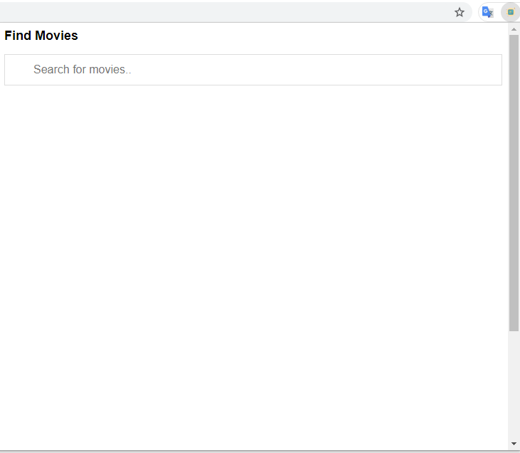
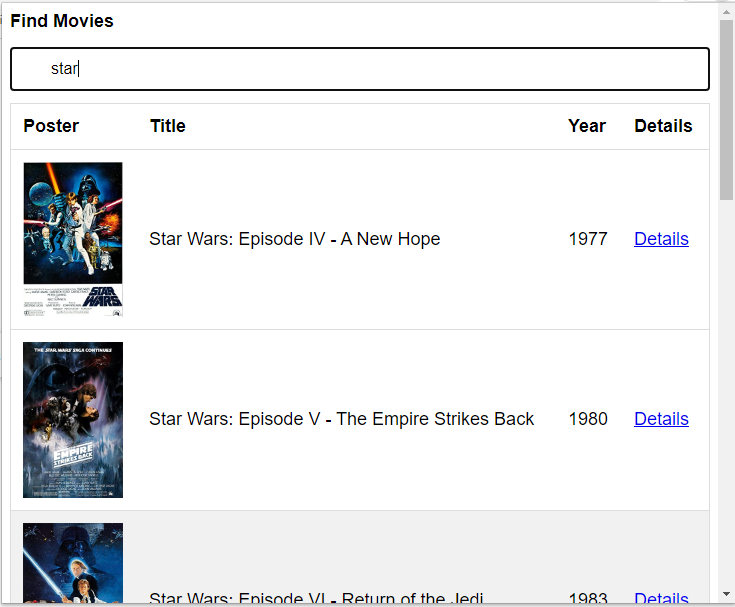
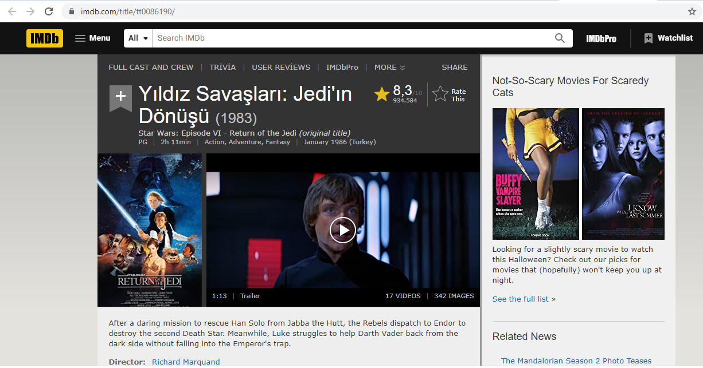

# moviefinder
**A chrome extension ,movie finder**

This project is an chrome extension, movie finder extension.

I used the ****OMDB API**** for this project.

***Send all data requests to:***

http://www.omdbapi.com/?apikey=[yourkey]&

***Poster API requests:***

http://img.omdbapi.com/?apikey=[yourkey]&

You need an apikey , get it on http://www.omdbapi.com/apikey.aspx 

And examine the parameters on http://www.omdbapi.com
 
 
<H1>Images from moviefinder extension:<H1>
 

 
 
 
 

 
 
 
 
<H3>Click the "Detail" Button on any line</H3>
 
 

 
 
 
 

